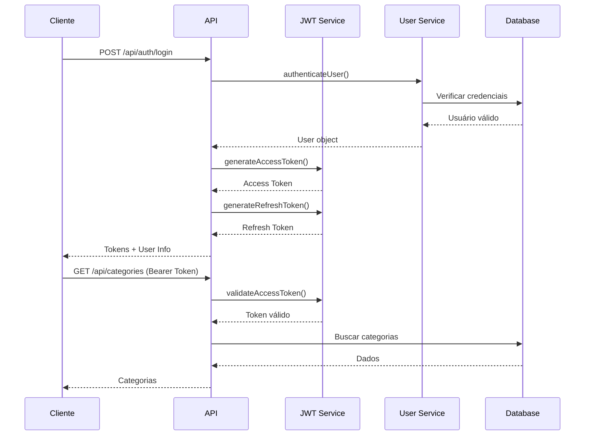

# 🔐 API Authentication Documentation

## Visão Geral

A API Portal Services utiliza autenticação baseada em **JWT (JSON Web Tokens)** com Bearer Token para proteger os endpoints. O sistema implementa:

- ✅ **Autenticação JWT** com Access Token e Refresh Token
- ✅ **Autorização baseada em Roles** (RBAC - Role-Based Access Control)
- ✅ **Permissões granulares** para controle fino de acesso
- ✅ **Rate Limiting** para prevenir ataques
- ✅ **Hash seguro de senhas** com bcrypt
- ✅ **Validação de entrada** com Zod

## 🚀 Quick Start

### 1. Fazer Login

```bash
curl -X POST http://localhost:3001/api/auth/login \
  -H "Content-Type: application/json" \
  -d '{
    "email": "admin@portalservices.com",
    "password": "Admin@123456"
  }'
```

### 2. Usar o Token nas Requisições

```bash
curl -X GET http://localhost:3001/api/categories \
  -H "Authorization: Bearer SEU_TOKEN_JWT_AQUI"
```

## 📋 Endpoints de Autenticação

### Login
**POST** `/api/auth/login`

Autentica um usuário e retorna tokens de acesso.

**Request Body:**
```json
{
  "email": "user@example.com",
  "password": "senha123",
  "rememberMe": false  // opcional
}
```

**Response (200 OK):**
```json
{
  "success": true,
  "accessToken": "eyJhbGciOiJIUzI1NiIs...",
  "refreshToken": "eyJhbGciOiJIUzI1NiIs...",
  "expiresIn": 900,
  "tokenType": "Bearer",
  "user": {
    "id": "uuid",
    "email": "user@example.com",
    "name": "User Name",
    "role": "user",
    "permissions": ["read_client", "create_quotation"]
  }
}
```

### Registro
**POST** `/api/auth/register`

Registra um novo usuário no sistema.

**Request Body:**
```json
{
  "email": "newuser@example.com",
  "password": "SenhaSegura@123",
  "name": "Nome do Usuário",
  "role": "user"  // opcional: "user" ou "guest"
}
```

### Refresh Token
**POST** `/api/auth/refresh`

Renova o access token usando um refresh token válido.

**Request Body:**
```json
{
  "refreshToken": "eyJhbGciOiJIUzI1NiIs..."
}
```

### Logout
**POST** `/api/auth/logout`

Faz logout do usuário e revoga todos os refresh tokens.

**Headers:**
```
Authorization: Bearer SEU_TOKEN_JWT_AQUI
```

### Informações do Usuário
**GET** `/api/auth/me`

Retorna informações do usuário autenticado.

**Headers:**
```
Authorization: Bearer SEU_TOKEN_JWT_AQUI
```

### Validar Token
**POST** `/api/auth/validate`

Valida se um token JWT é válido.

**Headers:**
```
Authorization: Bearer TOKEN_PARA_VALIDAR
```

### Alterar Senha
**POST** `/api/auth/password/change`

Altera a senha do usuário autenticado.

**Headers:**
```
Authorization: Bearer SEU_TOKEN_JWT_AQUI
```

**Request Body:**
```json
{
  "currentPassword": "senhaAtual123",
  "newPassword": "NovaSenha@456"
}
```

### Solicitar Reset de Senha
**POST** `/api/auth/password/reset-request`

Solicita reset de senha (envia token por email em produção).

**Request Body:**
```json
{
  "email": "user@example.com"
}
```

### Resetar Senha
**POST** `/api/auth/password/reset`

Reseta a senha usando o token recebido.

**Request Body:**
```json
{
  "token": "reset-token-aqui",
  "newPassword": "NovaSenha@789"
}
```

## 👥 Usuários Padrão

Para desenvolvimento, o sistema cria automaticamente os seguintes usuários:

| Email | Senha | Role | Descrição |
|-------|-------|------|-----------|
| admin@portalservices.com | Admin@123456 | super_admin | Acesso total ao sistema |
| manager@portalservices.com | Manager@123456 | manager | Gerenciamento de recursos |
| user@portalservices.com | User@123456 | user | Usuário comum |
| guest@portalservices.com | Guest@123456 | guest | Acesso limitado (apenas leitura) |

## 🔑 Roles e Permissões

### Roles Disponíveis

- **super_admin**: Acesso total, todas as permissões
- **admin**: Acesso administrativo (exceto gerenciamento de permissões)
- **manager**: Gerenciamento de recursos (CRUD de clientes, serviços, orçamentos)
- **user**: Operações básicas (leitura e criação limitada)
- **guest**: Apenas leitura de recursos públicos

### Permissões por Role

#### Super Admin
- Todas as permissões do sistema

#### Admin
- Todas as permissões exceto `manage_permissions`

#### Manager
- `create_client`, `read_client`, `update_client`
- `create_service`, `read_service`, `update_service`
- `create_quotation`, `read_quotation`, `update_quotation`, `approve_quotation`
- `create_appointment`, `read_appointment`, `update_appointment`
- `read_category`
- `access_reports`

#### User
- `read_client`
- `read_service`
- `create_quotation`, `read_quotation`
- `create_appointment`, `read_appointment`
- `read_category`

#### Guest
- `read_service`
- `read_category`

## 🛡️ Headers de Segurança

### Request Headers

```http
Authorization: Bearer SEU_TOKEN_JWT_AQUI
Content-Type: application/json
X-API-Key: sua-api-key  # Para integrações
```

### Response Headers

```http
X-RateLimit-Limit: 1000
X-RateLimit-Remaining: 999
X-RateLimit-Reset: 2024-01-01T12:00:00.000Z
X-Token-Expiring-Soon: true  # Quando token está próximo de expirar
Retry-After: 60  # Segundos para tentar novamente (429)
```

## ⚡ Rate Limiting

O sistema implementa diferentes níveis de rate limiting:

| Tipo | Limite | Janela | Aplicação |
|------|--------|--------|-----------|
| Global | 1000 req | 15 min | Todas as requisições |
| Autenticação | 10 req | 15 min | Endpoints de login |
| Criação | 100 req | 1 hora | Criação de recursos |
| API Key | 60 req | 1 min | Requisições com API Key |
| Por Usuário | 100 req | 1 min | Usuários autenticados |

## 🔧 Configuração

### Variáveis de Ambiente

```env
# JWT Configuration
JWT_SECRET=seu-secret-seguro-aqui
JWT_REFRESH_SECRET=outro-secret-seguro
JWT_ACCESS_EXPIRY=15m
JWT_REFRESH_EXPIRY=7d
JWT_ISSUER=portal-services-api
JWT_AUDIENCE=portal-services-client

# Security Options
REQUIRE_EMAIL_VERIFICATION=false
ENABLE_TWO_FACTOR=false
MAX_LOGIN_ATTEMPTS=5
LOCKOUT_DURATION_MINUTES=30

# Password Requirements
PASSWORD_MIN_LENGTH=8
PASSWORD_REQUIRE_UPPERCASE=true
PASSWORD_REQUIRE_LOWERCASE=true
PASSWORD_REQUIRE_NUMBERS=true
PASSWORD_REQUIRE_SPECIAL=true

# Session
SESSION_TIMEOUT_MINUTES=60
ALLOW_MULTIPLE_SESSIONS=true

# API Keys (comma separated)
VALID_API_KEYS=api-key-1,api-key-2
```

## 📝 Exemplos de Uso

### JavaScript/TypeScript

```javascript
// Login
const loginResponse = await fetch('http://localhost:3001/api/auth/login', {
  method: 'POST',
  headers: {
    'Content-Type': 'application/json'
  },
  body: JSON.stringify({
    email: 'user@portalservices.com',
    password: 'User@123456'
  })
});

const { accessToken } = await loginResponse.json();

// Usar token em requisições
const categoriesResponse = await fetch('http://localhost:3001/api/categories', {
  headers: {
    'Authorization': `Bearer ${accessToken}`
  }
});
```

### Python

```python
import requests

# Login
login_response = requests.post(
    'http://localhost:3001/api/auth/login',
    json={
        'email': 'user@portalservices.com',
        'password': 'User@123456'
    }
)

access_token = login_response.json()['accessToken']

# Usar token
categories_response = requests.get(
    'http://localhost:3001/api/categories',
    headers={'Authorization': f'Bearer {access_token}'}
)
```

### cURL

```bash
# Login e salvar token
TOKEN=$(curl -s -X POST http://localhost:3001/api/auth/login \
  -H "Content-Type: application/json" \
  -d '{"email":"user@portalservices.com","password":"User@123456"}' \
  | jq -r '.accessToken')

# Usar token
curl -X GET http://localhost:3001/api/categories \
  -H "Authorization: Bearer $TOKEN"
```

## 🚨 Códigos de Erro

| Código | Status | Descrição |
|--------|--------|-----------|
| NO_TOKEN | 401 | Token não fornecido |
| TOKEN_EXPIRED | 401 | Token expirado |
| INVALID_TOKEN | 403 | Token inválido |
| NOT_AUTHENTICATED | 401 | Usuário não autenticado |
| INSUFFICIENT_ROLE | 403 | Role insuficiente |
| INSUFFICIENT_PERMISSIONS | 403 | Permissões insuficientes |
| RATE_LIMIT_EXCEEDED | 429 | Limite de requisições excedido |
| INVALID_CREDENTIALS | 401 | Credenciais inválidas |
| EMAIL_IN_USE | 409 | Email já cadastrado |

## 🔄 Fluxo de Autenticação



## ✅ Checklist de Segurança

- [x] Senhas hasheadas com bcrypt (10 rounds)
- [x] Tokens JWT com expiração configurável
- [x] Refresh tokens para renovação segura
- [x] Rate limiting por IP e por usuário
- [x] Validação de entrada com Zod
- [x] Proteção contra força bruta (lockout)
- [x] Headers de segurança (CORS, etc)
- [x] Logs de auditoria para ações sensíveis
- [x] Limpeza automática de tokens expirados
- [x] Suporte a API Keys para integrações

## 📚 Recursos Adicionais

- [JWT.io](https://jwt.io/) - Debugger de tokens JWT
- [OWASP Authentication Cheatsheet](https://cheatsheetseries.owasp.org/cheatsheets/Authentication_Cheat_Sheet.html)
- [bcrypt](https://github.com/kelektiv/node.bcrypt.js) - Documentação do bcrypt
- [Zod](https://zod.dev/) - Validação de schemas TypeScript
